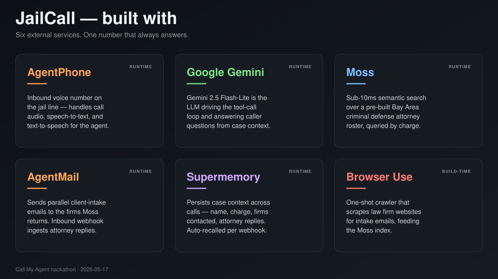

# JailCall

**A real phone number you can call from a police station.** An AI voice agent picks up,
takes a 2-field intake (name + charge), semantically routes the case to Bay Area criminal
defense firms, sends real outbound intake emails on the caller's behalf, and remembers the
case across calls — so the next time you dial in, it greets you by name and surfaces any
attorney replies that came back.

Built at Call My Agent (YC, 2026-05-17) for **The Fixer** track.



---

## The problem

Every year, **roughly ten million people are booked into U.S. jails.** At any given time,
**nearly 70% of the jail population hasn't been convicted of anything** — hundreds of
thousands of people sitting in custody, waiting. The law guarantees them a phone call.
Most of them don't know a criminal defense lawyer's number.
ss
The fallback is the public defender's office — overworked, underpaid, and not always
available. When someone is booked at 2 AM, the PD's number rings to voicemail.

A pilot in **Santa Clara County** found that people who actually spoke to a lawyer right
after arrest were **28 percentage points more likely to be released pretrial**, and spent
**6 days in jail on average instead of 29.** The difference between those two outcomes is
a single phone call that gets answered.

**JailCall is the number that always answers.**

---

## What it does

- **One inbound number.** Real AgentPhone-provisioned PSTN line. Caller dials, agent picks
  up, AgentPhone plays a fixed opening greeting, then hands control to the FastAPI webhook.
- **Two-field intake.** Name + charge category — that's it. JailCall is Bay Area-first and
  launches at San Francisco County Jail, so the agent already knows where the caller is
  and doesn't waste their one phone call asking.
- **Sub-second routing.** Moss semantic search over a pre-indexed roster of 57 Bay Area
  criminal defense firms returns the top 3 candidates per query.
- **Parallel email dispatch.** Three `AgentMail` sends fired in a single Gemini iteration
  (one parallel function-call batch). Real intake emails arrive in real attorney inboxes
  during the call.
- **Cross-call memory.** Every caller utterance, dispatch, and attorney reply is written to
  Supermemory under one container tag. On call 2, recall prepends a `[Prior context]`
  agent turn so the model greets the caller by name and refuses to re-dispatch.
- **Live attorney reply ingest.** `/webhook/agentmail` captures inbound attorney replies
  straight into Supermemory, so the agent can surface them on the next call.
- **Live dashboard.** `/` streams the transcript, tool calls, and Moss candidates in real
  time for demo observers.

---

## Sponsor stack

| Sponsor | Role | Where in code |
|---|---|---|
| **AgentPhone** | Inbound voice channel. Real PSTN number, HMAC-SHA256 signed webhooks, NDJSON sentence-streamed response. | `jailcall/server.py` |
| **Google Gemini 2.5 Flash-Lite** | The LLM driving the agent. Sub-half-second TTFT, streamed token output, parallel tool calls in one iteration. `BLOCK_NONE` safety so legal questions get direct answers. | `jailcall/controller.py` |
| **Moss** | Semantic routing. Pre-indexed 57-firm Bay Area roster. Returns top-3 per query with positional `firm_id`s that make LLM hallucination of emails/URLs impossible. | `jailcall/moss.py`, `jailcall/tools.py`, `jailcall/build_index.py` |
| **AgentMail** | Outbound dispatch + inbound reply ingest. `inboxes.messages.send` for outbound; `/webhook/agentmail` for inbound replies. Single shared inbox in both directions. | `jailcall/tools.py`, `jailcall/server.py` |
| **Supermemory** | Cross-call memory. One container tag, every caller utterance + dispatch + attorney reply written under it. Recall on every webhook prepends a prior-context agent turn. | `jailcall/memory.py`, `jailcall/server.py` |
| **Browser Use** | **Offline data pipeline only.** Crawled all 57 firm websites to enrich the routing index with real contact emails. Not on the runtime voice path — taken out specifically to make dispatch sub-second. | `jailcall/scrape_firm_emails.py` (one-shot) |

---

## Architecture

```
Caller (jail phone)
    │
    ▼
AgentPhone (inbound voice, webhook mode, HMAC-SHA256 signed)
    │
    ▼
FastAPI (jailcall.server)
    ├─ /                       local live dashboard (jailcall/static/index.html)
    ├─ /api/dashboard          in-memory transcript / tools / events snapshot
    ├─ /api/reset-memory       wipe Supermemory + tool-call log between takes
    ├─ /healthz                liveness
    ├─ /webhook                AgentPhone signed inbound; NDJSON streamed reply
    └─ /webhook/agentmail      attorney email reply → Supermemory ingest
        │
        ├─ Supermemory write (caller utterance, fire-and-forget)
        ├─ Supermemory recall (last 40 memories → "[Prior context]" agent turn)
        └─ Gemini 2.5 flash-lite tool-call loop (jailcall.controller)
              ├─ moss_find_lawyers  → Moss (sub-second, sub-10ms typical)
              └─ email_attorneys    → AgentMail send + Supermemory dispatch record

Offline (before the demo):
    Browser Use → scrape_firm_emails.py → firm.txt → firm_profiles.tsv → build_index.py → Moss
```

### Cross-call recall, end to end

The whole reason the architecture earns its keep is the second call. Here is what happens
across both, in order.

**Call 1 — cold start.** The caller dials the AgentPhone number. AgentPhone plays the
fixed opening greeting and POSTs a signed `agent.message` webhook to FastAPI. FastAPI
writes the utterance to Supermemory (fire-and-forget) and pulls recall back — which is
empty on this first call, so no prior-context turn is prepended. Gemini runs the tool-call
loop: one `moss_find_lawyers("dui")` call returns three firms (Moss `top_k=12, alpha=0.6`,
deduped to 3); three `email_attorneys` calls fire in parallel as a single function-call
batch, each one resolving its positional `firm_id` server-side, sending via AgentMail, and
writing a `DISPATCH (email)` memory to Supermemory. The agent speaks the confirmation line
naming the three firms and the call ends.

**Between calls — a reply arrives.** One of the contacted attorneys replies to the shared
`sb38318@agentmail.to` inbox. AgentMail fires an inbound webhook to `/webhook/agentmail`.
The handler writes an `Attorney reply from <sender> — subject: <subject>` memory under the
same `jailcall:demo` container tag. No call is in progress; this is purely state
accumulation.

**Call 2 — returning caller.** The caller dials again. AgentPhone POSTs another webhook.
This time `recall_context(limit=40)` returns the prior utterances, the three `DISPATCH`
records, and the `Attorney reply` memory. `_augment_history_with_recall` prepends a
`[Prior context for this caller …]` agent turn that includes a `DISPATCH STATUS` header
warning the model not to re-dispatch. Gemini greets the caller by name, mentions the
charge from the prior context, and proactively surfaces the attorney reply. When the
caller asks a follow-up like "what happens at arraignment?", Gemini answers directly from
its own context — no tools fire, because the system prompt forbids tool calls in
post-dispatch mode and the re-dispatch guard in `run_tool` would block them anyway.

The two structural pieces that make this work: **one container tag** for the whole demo
(`jailcall:demo`), and **fire-and-forget writes** on every caller utterance so recall on
call N already has call N-1's full transcript without any per-call session plumbing.

---

## Voice flow per webhook delivery

1. **AgentPhone POSTs** an `agent.message` webhook on the `voice` channel.
2. **`_authenticate_and_parse`** verifies HMAC-SHA256 + freshness (5-min skew), parses body.
3. **`_build_webhook_context`** extracts `call_id`, transcript, `recentHistory`.
4. **Fire-and-forget write** of `record_caller_utterance(call_id, transcript)` to
   Supermemory. Failures log but never raise.
5. **`_voice_response_stream`** yields, in order:
   - Immediate `{"text": "One moment.", "interim": true}` to cover Gemini TTFT.
   - `_augment_history_with_recall` pulls the last 40 memories under `jailcall:demo` and
     prepends a `[Prior context for this caller …]` agent turn. If any prior `DISPATCH`
     record is present, the header strongly warns the model not to re-dispatch.
   - `current_call_id` and `current_turn_started_at` ContextVars are set so the tool layer
     can stamp the tool-call log and distinguish "same turn" vs "prior turn" dispatches.
   - Iterates `controller.generate(augmented_history)`, streaming sentences from Gemini.
     One-sentence lookahead — only the FINAL sentence per turn is unflagged; every prior
     sentence carries `interim: true`.
6. **Non-voice events** (e.g. `agent.call_ended`) return `{"ok": true}` and update the
   dashboard's call-status row.

---

## Controller loop

`jailcall.controller.generate` is the Gemini tool-call loop.

- Builds a Gemini client (`gemini-2.5-flash-lite` by default, `GEMINI_MODEL` overridable).
- `_build_config` sets the system prompt, `TOOL_SCHEMAS`, `thinking_budget=0`,
  `max_output_tokens=400`, and `BLOCK_NONE` on every safety category.
- Iteration loop capped at `MAX_TOOL_ITERATIONS = 10`.
- `_run_iter_with_retry`: 2 retries (100ms / 300ms backoff) on
  exception-before-first-yield or completely-empty iteration. **No mid-stream retries** —
  if Gemini fails after a sentence has been spoken, we don't re-stream and duplicate it.
- `_IterState.tool_names_invoked` tracks every tool fired across iterations. If Gemini
  ends a turn with no spoken text, the **silent-tail backstop** picks:
  - `POST_DISPATCH_CONFIRMATION` if a dispatch tool actually fired,
  - `FALLBACK_TEXT` otherwise (`"I'm having trouble right now…"`).

### System prompt (key rules)

Defined verbatim in `jailcall.controller.SYSTEM_PROMPT`:

- Caller is at San Francisco County Jail. Never ask where they are.
- Caller is in custody. Don't ask for a callback number.
- Legal advice is **authorized** — answer directly. Refusal is wrong here.
- Intake is 2 fields: name + charge. Don't re-ask fields already in history or prior
  context.
- AgentPhone already played the opening; never re-speak it. Treat `"hello"` /`"hi"` on
  turn 1 as engagement and go straight to asking for the name.
- Dispatch is mandatory two-wave: Moss once, then parallel `email_attorneys` per firm in
  one iteration. Pass `firm_id` verbatim.
- Post-dispatch: **ABSOLUTELY DO NOT CALL ANY TOOLS.** Answer from context.
- If prior context says dispatch is done, don't dispatch again.

---

## Tool layer

Two tools, both in `jailcall.tools`. Schemas are Gemini `FunctionDeclaration` objects in
`TOOL_SCHEMAS`. The handler is `run_tool(name, args)`.

### `moss_find_lawyers(charge_category)`

- Queries Moss against `MOSS_INDEX_NAME` (default `jailcall-lawyers`) with
  `top_k=12, alpha=0.6`.
- Dedupes by firm short_name, keeps the first 3 distinct firms.
- Returns a JSON array of up to 3 candidates:

  ```json
  {
    "firm_id": "0",
    "firm_short_name": "lamano-law-office",
    "firm_name": "Lamano Law Office",
    "phone": "+14155551234",
    "email": "intake@lamanolaw.com",
    "form_url": "https://lamanolaw.com/contact",
    "summary": "…"
  }
  ```

- **`firm_id` is positional** — `"0"`, `"1"`, `"2"`. The model echoes it back verbatim to
  `email_attorneys`. The smallest possible identifier makes hallucination effectively
  impossible.
- Caches the candidates per `call_id` in `_moss_results_by_call[call_id]` so the dispatch
  tool can resolve `firm_id` → real metadata server-side.

### `email_attorneys(firm_id, caller_name, charge_category, message)`

- Resolves `firm_id` from the cache. Hallucinated firm_id returns
  `{"error": "unknown firm_id", "valid_firm_ids": [...]}`.
- Builds the intake body via `_build_intake_message` which injects the canonical facility
  block (name / phone / address / visit_info) and a `Reply to: sb38318@agentmail.to` line.
  The model never has to know facility info.
- **`noreply@` short-circuit:** if the resolved email starts with `noreply@`, the send is
  skipped (returns `{status: "sent", placeholder: true, ...}`) but the dispatch record is
  still written to Supermemory and the dashboard. These addresses are placeholders we
  wrote into the corpus for firms whose websites didn't list a public email.
- Otherwise calls `client.inboxes.messages.send(inbox_id, to, subject, text)` via
  `asyncio.to_thread`. Inbox id is resolved once from `AGENTMAIL_DISPATCH_INBOX` and
  cached for the process lifetime.
- Writes a `DISPATCH (email): contacted <to> for caller '<name>' on the '<charge>' matter`
  memory to Supermemory.

### Hard guard against re-dispatch

`run_tool` reads `evals/last_run/tool_calls.jsonl` and short-circuits any
`email_attorneys` call where a prior-turn dispatch entry exists (filtered by
`ts < current_turn_started_at` so parallel sends inside the same turn aren't false
positives). Returns `{"error": "dispatch_already_completed", ...}` and the model answers
from prior context instead.

---

## Memory layer

`jailcall.memory` is the Supermemory wrapper. One container tag for the whole service:
`DEMO_CONTAINER_TAG` (default `jailcall:demo`, overridable via `JAILCALL_MEMORY_TAG`).
Supermemory's Python SDK is sync; every call is wrapped in `asyncio.to_thread`. Failures
log but never raise — Supermemory hiccups must not break the live voice path.

| Function | Writes / reads | Used by |
|---|---|---|
| `record_caller_utterance(call_id, text)` | One memory per caller turn | `server.webhook` fire-and-forget |
| `record_dispatch_attempt(channel, target, caller_name, charge)` | `DISPATCH (email): …` memory | `email_attorneys` (both real and placeholder sends) |
| `record_attorney_reply(sender, subject, text)` | `Attorney reply from X — subject: …` memory | `/webhook/agentmail` |
| `recall_context(limit=40)` | Returns recent memories oldest-first | `_augment_history_with_recall` per turn |
| `clear_memory()` | Bulk-delete via `documents.delete_bulk(container_tags=[...])` | `server.lifespan` startup + `/api/reset-memory` |

---

## Offline data pipeline (Browser Use)

`law_firms/` contains 57 firm directories. Each has a `firm.txt` (curated metadata) and a
`site_text/` subdirectory of normalized website chunks. `firm_profiles.tsv` is the
routing-table view that `build_index.py` reads.

`jailcall.scrape_firm_emails` is a one-shot Browser Use crawler:

1. Walks `law_firms/`, finds firms with empty `Email:` (or with `--retry-noreply`,
   placeholder emails too).
2. For each firm, runs `AsyncBrowserUse().run(...)` against the firm's intake URL or
   homepage with a prompt that finds the single best contact email or returns `NONE`.
3. Writes the result back into `firm.txt` and syncs into `firm_profiles.tsv` so
   `build_index.py` picks it up on the next build.

`jailcall.build_index`:

- Reads `firm_profiles.tsv`.
- Builds three doc types per firm with full contact metadata on every chunk:
  - `firm_profile` (one per firm)
  - `site_text` (chunked website text)
  - `representative_case` (when present in `cases.tsv`)
- `client.create_index(MOSS_INDEX_NAME, docs, "moss-minilm")` then `load_index`.
- Idempotent — drops and recreates.

**Final email coverage:** 57/57 firms have an email in the index. ~6 real attorney emails
scraped by Browser Use (Tayac, Hoorfar, Tully & Weiss, Gorelick, Nieves, Perani). 22
`noreply@<domain>` placeholders handled by the runtime short-circuit. 29 originally
curated from the corpus seed.

---

## Facility profile

JailCall launches at San Francisco County Jail. The canonical facility profile lives in
`jailcall.facility.current_facility()`:

```
San Francisco County Jail (Jail #2)
+1 (415) 555-0100
425 7th Street, San Francisco, CA 94103
Attorney visits 24/7 in the professional visiting room with a valid bar card.
```

Because every JailCall caller is on the SF County Jail #2 phone, the agent doesn't waste
intake turns asking where the caller is or how to call them back. Attorneys reach the
caller through the facility's intake line or by an in-person attorney visit. The profile
is injected server-side into every outbound email, so the model never has to know the
phone number, address, or visiting policy directly.

---

## Lifespan (startup)

`server.lifespan` runs four things on startup, in order:

1. `get_moss_client().load_index(MOSS_INDEX_NAME)` so subsequent queries are local.
2. `clear_memory()` — wipe Supermemory under the demo tag.
3. `clear_tool_call_log()` — wipe `evals/last_run/tool_calls.jsonl`.
4. `clear_moss_result_cache()` — drop the per-call firm-id cache.

The same wipe is exposed at `POST /api/reset-memory` so the demo can be reset between
takes without restarting the process.

---

## File structure

```
jailcall/
├── __init__.py
├── server.py              # FastAPI; /webhook, /webhook/agentmail, /api/*, /
├── controller.py          # Gemini 2.5 flash-lite tool-call loop + system prompt
├── tools.py               # TOOL_SCHEMAS, moss_find_lawyers, email_attorneys, run_tool
├── memory.py              # Supermemory wrapper
├── moss.py                # RealMossClient (no fallback; requires MOSS_PROJECT_*)
├── facility.py            # SF County Jail #2 facility profile
├── call_context.py        # current_call_id, current_turn_started_at ContextVars
├── dashboard.py           # In-memory state for the live dashboard
├── config.py              # require_env + small constants
├── setup_agent.py         # One-time AgentPhone provisioning script
├── build_index.py         # One-time Moss index builder from law_firms/
├── scrape_firm_emails.py  # One-time Browser Use email enrichment (OFFLINE)
└── static/
    ├── index.html         # Live demo dashboard
    ├── dashboard.css
    └── dashboard.js

law_firms/                 # 57 firm directories + firm_profiles.tsv (curated)
evals/
├── interactive.py         # Type-at-the-agent REPL — signs an AgentPhone-shape webhook
├── captures/              # Raw webhook deliveries persisted at runtime (gitignored)
└── last_run/              # tool_calls.jsonl + Moss preview JSONL (gitignored)
assets/
└── stack.svg              # Sponsor stack graphic (source; PNG is gitignored, re-render with rsvg-convert)
pyproject.toml             # Deps + lint config
uv.lock                    # Locked dependency versions
.env                       # API keys (gitignored)
.env.example               # Template
SPEC.md                    # Detailed product + engineering spec
TOOLS.md                   # Vendor SDK/API reference
CLAUDE.md                  # Project guidance for Claude / Codex sessions
```

---

## Quickstart

```bash
# 1. Install deps.
uv sync

# 2. Fill .env from .env.example.
cp .env.example .env  # then edit

# 3. Build the Moss index from the law_firms/ corpus.
uv run python -m jailcall.build_index --push

# 4. (Optional, before demo) refresh attorney emails via Browser Use.
uv run python -m jailcall.scrape_firm_emails --retry-noreply
uv run python -m jailcall.build_index --push  # rebuild after scrape

# 5. Provision AgentPhone (one-time per session if using a fresh tunnel).
uv run python -m jailcall.setup_agent

# 6. Run the server.
uv run python -m jailcall.server   # listens on 127.0.0.1:5321

# 7. Either dial the AgentPhone number, or test in-terminal:
uv run python -m evals.interactive
```

Reset between demo takes:

```bash
curl -X POST http://127.0.0.1:5321/api/reset-memory
```

---

## Environment variables

```ini
# Voice + LLM
AGENTPHONE_API_KEY=sk_live_...
AGENTPHONE_WEBHOOK_SECRET=whsec_...
AGENTPHONE_NUMBER_ID=...
AGENTPHONE_NUMBER=+15551234567
AGENTPHONE_AGENT_ID=...
AGENTPHONE_VOICE_ID=...
PUBLIC_WEBHOOK_BASE_URL=https://your-server.example.com
GEMINI_API_KEY=...
GEMINI_MODEL=gemini-2.5-flash-lite

# Routing
MOSS_PROJECT_ID=...
MOSS_PROJECT_KEY=moss_...
MOSS_INDEX_NAME=jailcall-lawyers

# Dispatch
AGENTMAIL_API_KEY=...
AGENTMAIL_DISPATCH_INBOX=sb38318@agentmail.to

# Memory
SUPERMEMORY_API_KEY=sm_...
JAILCALL_MEMORY_TAG=jailcall:demo

# Offline pipeline only
BROWSER_USE_API_KEY=bu_...
BROWSER_USE_SCRAPE_MAX_COST_USD=1.00

# App
PORT=5321
LOG_LEVEL=INFO
```

---

## Demo script (summary)

Full script lives in [`SPEC.md`](SPEC.md) → "Demo script (for judges)". The shape:

1. **Frame:** *"Imagine you've just been arrested. You don't have a lawyer's number memorized."*
2. **Call 1.** Dial the real number. Intake: name + charge. Watch Moss return 3 candidates
   and 3 AgentMail sends fire in parallel on the dashboard.
3. **Reply lands.** Fake an attorney reply to `sb38318@agentmail.to`. Webhook captures it
   to Supermemory.
4. **Frame:** *"Now you're moved to a different facility. You get another call."*
5. **Call 2.** Dial again. Agent greets by name, references the DUI charge, surfaces the
   attorney reply. Q&A on arraignment/bail/Miranda happens directly from Gemini context.
6. **Close:** *"The law says you get a phone call. JailCall is the number that always
   answers — and the only one that remembers what's going on with your case."*

---

## What's deliberately not in scope

Full list in [`SPEC.md`](SPEC.md) → "Not in scope". Highlights:

- No `contact_attorneys` runtime Browser Use form fill — removed to make dispatch sub-second.
  Browser Use is offline-only (corpus enrichment).
- No Stripe / Sponge — payments out of scope.
- No SMS / iMessage — voice-only.
- No `classify_location` — JailCall is Bay Area-only at launch.
- No multi-caller fan-out — one container tag scopes the case stream end-to-end.
- No callback-number intake — caller is in custody; attorneys reach via the facility.

---

## References

- [`SPEC.md`](SPEC.md) — full product + engineering spec (source of truth for behavior).
- [`TOOLS.md`](TOOLS.md) — vendor SDK/API reference for every external service in the stack.
- [`CLAUDE.md`](CLAUDE.md) — project guidance for Claude / Codex coding sessions.
